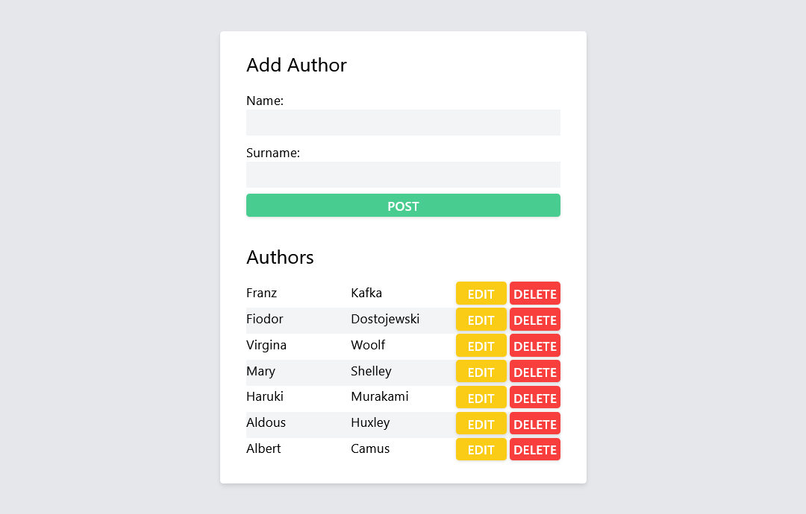

# FastAPI-CRUD

Technologie webowe - Semestr letni 2023/2024

Prosta aplikacja CRUD zbudowana przy użyciu FastAPI, która umożliwia zarządzanie kolekcją autorów. Aplikacja udostępnia cztery podstawowe operacje: odczyt, tworzenie, aktualizację i usuwanie autorów.

## Endpointy

### GET /authors

- Pobierz listę wszystkich autorów.

### POST /authors

- Stwórz nowego autora.

### DELETE /authors/{author_id}

- Usuń autora na podstawie ID.

### PUT /authors/{author_id}

- Zaktualizuj dane istniejącego autora.